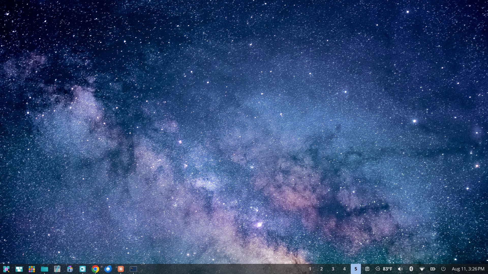
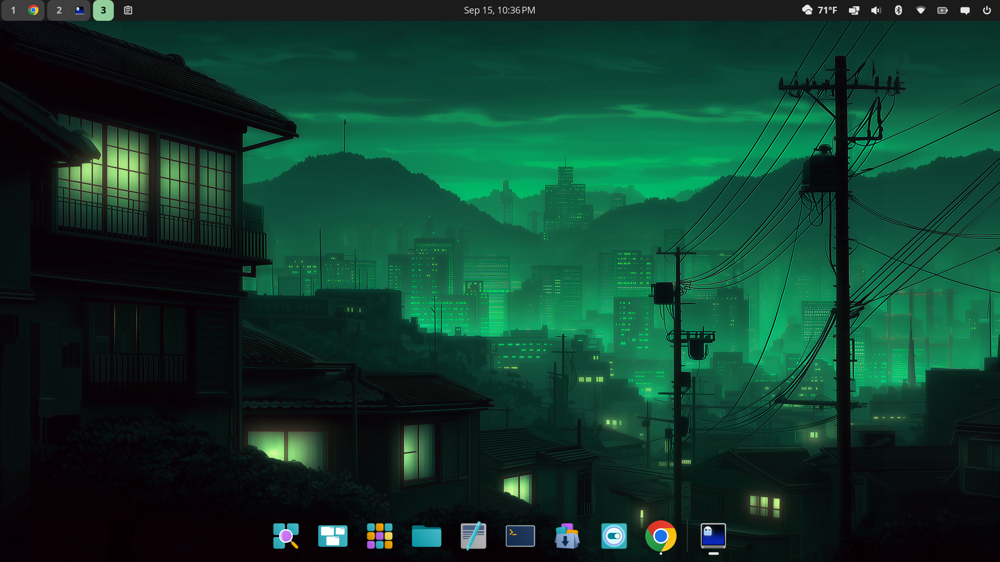
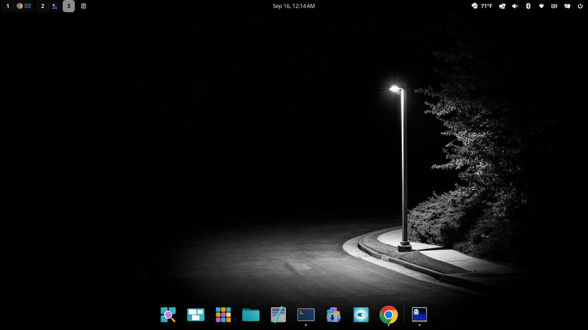

# Cosmic Desktop Customization

Tracked configuration for a redesigned [COSMIC](https://system76.com/cosmic)
desktop, on Greg's Dell E7450 laptop. Each subdirectory under `rices/` is a
self-contained rice — its own `cosmic/` config, its own README, and (where
the rice was captured live rather than hand-built) its own screenshots.
`dotfiles/` holds tracked shell/tool config (e.g. `.tmux.conf`) unrelated to
the COSMIC rices themselves. Only `rices/`, `dotfiles/`, and this file are
tracked (see `.gitignore`); everything else under `~/.config` (browser
profiles, app caches, unrelated app settings) is deliberately left out.

## Rices

| Rice | Look | Base system | Source |
|---|---|---|---|
| [`milky-way`](rices/milky-way/README.md) | Milky Way core wallpaper, squared-off corners, persistent full-width dock, Yaru theme | Pop!_OS 24.04 / Arch Linux | Live snapshot |
| [`osaka-jade`](rices/osaka-jade/README.md) | Green/jade neon cityscape wallpaper, jade accent color, floating auto-hide dock, stock COSMIC theme | Fedora Linux 44 (COSMIC Spin) / Arch Linux | Live snapshot |
| [`onyx`](rices/onyx/README.md) | Pure-black/grey [Onyx](https://github.com/ggregoro/onyx) palette ported from Omarchy, `Dark Street Light` wallpaper | Fedora Linux 44 (COSMIC Spin) / Arch Linux | Hand-derived config, applied live and confirmed rendering correctly — see its README for the one remaining caveat |

| Milky Way | Osaka Jade | Onyx |
|---|---|---|
|  |  |  |

## Switching rices on this machine

Use `./switch-rice.sh <rice-name>` (or `--list` to see available rices).
It backs up your current config to a timestamped folder under
`~/.config/cosmic-backups/`, copies the chosen rice's config in, forces dark
mode, and restarts the panel/background so the change actually shows up
(see "If it doesn't visibly apply" below for why that restart matters). No
logout is needed — panel, dock, wallpaper, and window border/focus-highlight
colors (drawn by `cosmic-comp`, which the script doesn't touch) all update
live.

The script never restarts `cosmic-comp` itself — killing it in place would
crash the whole graphical session the same as a logout would. Earlier
testing (2026-09-16) saw window borders get stuck on the previous rice's
accent after a switch, but that traced back to `cosmic-comp` being left in a
stale state by an unrelated `rm -rf`-on-a-live-config incident earlier that
same session, not a limitation of the script — a round-trip switch
(`osaka-jade` → `onyx` → back) confirmed via real screenshots that borders
update live on every switch once `cosmic-comp` itself is healthy. If a
switch ever does leave borders stuck again, that's a sign `cosmic-comp` is
in a bad state (not something `switch-rice.sh` can fix) — log out and back
in to clear it.

## Trying one on a different machine

Each rice's own README has the full walkthrough (packages required, exact
`cp`/`git checkout` commands, wallpaper caveats). In short, for any rice:

1. Back up your own `~/.config/cosmic` first.
2. Clone this repo.
3. Copy `rices/<name>/cosmic/` into `~/.config/cosmic/`.
4. Point the wallpaper config at your own copy of the image (the tracked path is
   absolute and won't exist on your machine).

## If it doesn't visibly apply

Editing files under `~/.config/cosmic` while COSMIC is running usually
applies within a second or two — but the *files* aren't always the live
source of truth. If a panel/dock component's own process crashed and
respawned at some point (even briefly, e.g. during a bulk file operation),
it can come back up on stale/default state and simply not re-read the
correct files afterward, no matter how many times you rewrite them. If your
panel, dock, or wallpaper still shows stock defaults after copying a rice
in:

```bash
pkill -x cosmic-panel
pkill -x cosmic-bg
```

`cosmic-session` supervises both and restarts them within about a second,
picking up whatever's actually on disk (`switch-rice.sh` already does this
for you). If that doesn't fix it — or if it's specifically window borders
that are wrong — log out and back in; that guarantees every COSMIC
component, including the compositor, reloads from disk fresh.

## Restoring / reverting

- `git log` shows the full history from `pre-claude-baseline` (the state of
  `~/.config/cosmic` before this project started, back when the repo tracked
  only the `milky-way` rice at its root) through every change since, including
  the move to the current `rices/<name>/` layout.
- Each rice's own README has a rice-specific revert command.
