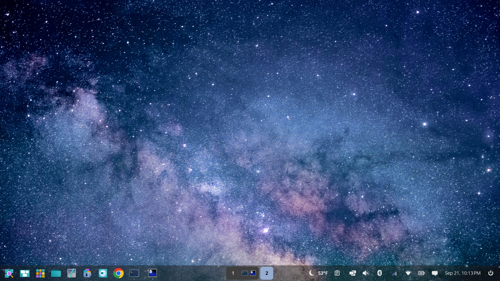
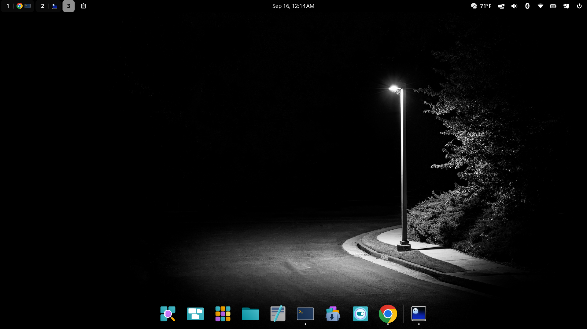
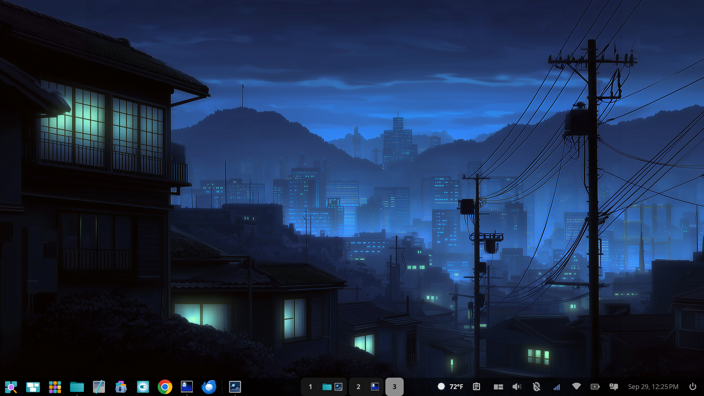

# Cosmic Desktop Customization

Five ready-made looks ("rices") for the [COSMIC](https://system76.com/cosmic)
desktop, and one script that installs or removes any of them.

| Milky Way | Osaka Jade | Onyx | Glowing City |
|---|---|---|---|
|  |  |  |  |

| Rice | Look | Changes |
|---|---|---|
| [`milky-way`](rices/milky-way/README.md) | Milky Way wallpaper, blue accent, one full-width bottom dock and no top panel, Yaru theme and icons | Colors, wallpaper, panel and dock layout |
| [`osaka-jade`](rices/osaka-jade/README.md) | Green neon city wallpaper, jade accent, top panel plus a floating dock that hides itself | Colors, wallpaper, panel and dock layout |
| [`onyx`](rices/onyx/README.md) | Pure black with grey accents, dark street wallpaper | Colors and wallpaper only |
| [`glowing-city`](rices/glowing-city/README.md) | Pure black with grey accents, blue neon city wallpaper | Colors and wallpaper only |
| [`violet-tide`](rices/violet-tide/README.md) | Dark slate-purple with a pink-lavender accent, purple sunset-over-water wallpaper, square corners, see-through terminal | Colors, corners, wallpaper and terminal opacity |

## Requirements

- A working COSMIC desktop on Pop!_OS, Arch Linux or Fedora (COSMIC Spin).
  Any other distro that uses `apt`, `pacman` or `dnf` should work the same
  way.
- `git`, to download this repo.

| Rice | Pop!_OS (`apt`) | Arch (`pacman`) | Fedora (`dnf`) |
|---|---|---|---|
| `milky-way` | tested | tested | not tested |
| `osaka-jade` | not tested | tested | tested |
| `onyx` | not tested | tested | tested |
| `glowing-city` | not tested | tested | not tested |
| `violet-tide` | not tested | not tested | not tested |

## Install

### 1. Get the repo

```bash
# Pop!_OS
sudo apt install git

# Arch
sudo pacman -S git

# Fedora
sudo dnf install git
```

```bash
git clone https://github.com/ggregoro/Cosmic-Desktop-Customization.git
cd Cosmic-Desktop-Customization
```

### 2. Install the dark GTK theme (optional)

Older GTK3 apps ignore COSMIC's dark mode and stay light unless the
`adw-gtk3-dark` theme is installed. The rice still applies without it.

```bash
# Arch
sudo pacman -S adw-gtk-theme

# Fedora
sudo dnf install adw-gtk3-theme
```

Pop!_OS has no `apt` package for it. Download the latest `adw-gtk3v*.tar.xz`
from the [adw-gtk3 releases page](https://github.com/lassekongo83/adw-gtk3/releases)
and unpack it into your themes folder:

```bash
mkdir -p ~/.local/share/themes
tar -xf ~/Downloads/adw-gtk3v*.tar.xz -C ~/.local/share/themes
```

GTK3 apps installed as Flatpaks need the Flatpak copy of the theme as well
(any distro):

```bash
flatpak install flathub org.gtk.Gtk3theme.adw-gtk3-dark
```

### 3. Install the extras your rice needs

`milky-way` and `osaka-jade` use three extra panel applets, and `milky-way`
also uses the Yaru theme. The commands are in each rice's own README:
[`milky-way`](rices/milky-way/README.md#extras),
[`osaka-jade`](rices/osaka-jade/README.md#extras).
`onyx` and `glowing-city` need nothing extra.
[`violet-tide`](rices/violet-tide/README.md#extras) has optional terminal
colors to import by hand.

### 4. Apply the rice

```bash
./switch-rice.sh --list
./switch-rice.sh osaka-jade
```

The script:

1. Saves your current COSMIC settings to a dated folder under
   `~/.config/cosmic-backups/`.
2. Copies the rice's wallpaper to `~/Pictures`.
3. Copies the rice's settings into `~/.config/cosmic`.
4. Turns on dark mode and sets the GTK theme (and the icon theme, for
   `milky-way`).
5. Restarts the panel and the wallpaper so the change shows at once. No
   logout is needed.

Run it again with another name to switch rices. `onyx`, `glowing-city` and
`violet-tide` leave the panel and dock as they are, so apply them on top of whichever
layout you want to keep.

## Uninstall

Put back the settings you had before the last switch:

```bash
./switch-rice.sh --restore
```

Each switch makes its own backup. To go back further, name the backup
folder (the oldest one holds your settings from before the first rice):

```bash
ls ~/.config/cosmic-backups
./switch-rice.sh --restore 20260101-120000
```

The restore puts back your COSMIC settings, dark-mode setting, GTK theme and
icon theme. It leaves the wallpaper images in `~/Pictures` and any packages
you installed; remove those yourself if you no longer want them. Package
removal commands are in each rice's README.

## Troubleshooting

**The panel, dock or wallpaper still shows the old look.** Restart them:

```bash
pkill -x cosmic-panel
pkill -x cosmic-bg
```

COSMIC starts both again within a second. If that does not help, or if only
the window borders are wrong, log out and back in.

**A panel applet is missing.** The rice lists an applet that is not
installed. Install it (see the rice's README) and restart the panel as above.

**Do not delete or move `~/.config/cosmic` while COSMIC is running.** COSMIC
rewrites the folder as you remove it and the result is a mix of old and
default settings. Use `./switch-rice.sh --restore`, which copies files back
in place.

## Wallpaper credits

- `milky-way`: photo by
  [Jeremy Thomas on Unsplash](https://unsplash.com/photos/blue-and-purple-galaxy-digital-wallpaper-E0AHdsENmDg)
  (Unsplash License).
- `osaka-jade`: from the Osaka Jade theme in
  [Omarchy](https://github.com/omacom/omarchy) (MIT License).
- `onyx`: from the [Onyx](https://github.com/ggregoro/onyx) theme.
- `glowing-city`: a blue-tinted edit of the `osaka-jade` wallpaper.
- `violet-tide`: four photos from Unsplash (Unsplash License), by Engin
  Yapici, Artiom Vallat, Loris Boulinguez and Vishnu K R.
