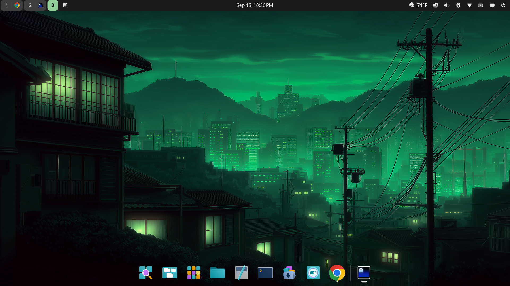

# Osaka Jade



- **Wallpaper:** a green neon city at night.
- **Colors:** dark mode, jade accent (`#63D0DF`), COSMIC's standard rounded
  corners.
- **Layout:** a slim top panel with workspace icons and clipboard on the
  left, the clock in the center, and weather, tray, tiling, sound,
  Bluetooth, network, battery, notifications and power on the right. A
  floating, transparent dock at the bottom holds the launcher and pinned
  apps and hides when a window overlaps it.
- **Theme and icons:** COSMIC's own.
- **Windows:** floating (tiling is off).
- **Terminal:** COSMIC Terminal in JetBrainsMono Nerd Font if it is
  installed.

Tested on Pop!_OS, Fedora (COSMIC Spin) and Arch Linux.

## Extras

**Panel applets** (weather, clipboard manager, workspace icons), from
Flathub on any distro. Install them before applying the rice; any you skip
is left out of the panel and the rest still applies.

```bash
flatpak remote-add --if-not-exists --user flathub https://dl.flathub.org/repo/flathub.flatpakrepo
flatpak install --user flathub com.vintagetechie.CosmicExtAppletTempest
flatpak install --user flathub io.github.cosmic_utils.cosmic-ext-applet-clipboard-manager
flatpak install --user flathub io.github.crocodile.cosmic-ext-applet-workspace-icons
```

On Arch, install Flatpak first with `sudo pacman -S flatpak`.

## Install

From the repo folder (see the [main README](../../README.md#install) for the
full steps):

```bash
./switch-rice.sh osaka-jade
```

## Uninstall

```bash
./switch-rice.sh --restore
```

To remove the applets as well:

```bash
flatpak uninstall --user com.vintagetechie.CosmicExtAppletTempest
flatpak uninstall --user io.github.cosmic_utils.cosmic-ext-applet-clipboard-manager
flatpak uninstall --user io.github.crocodile.cosmic-ext-applet-workspace-icons
```
