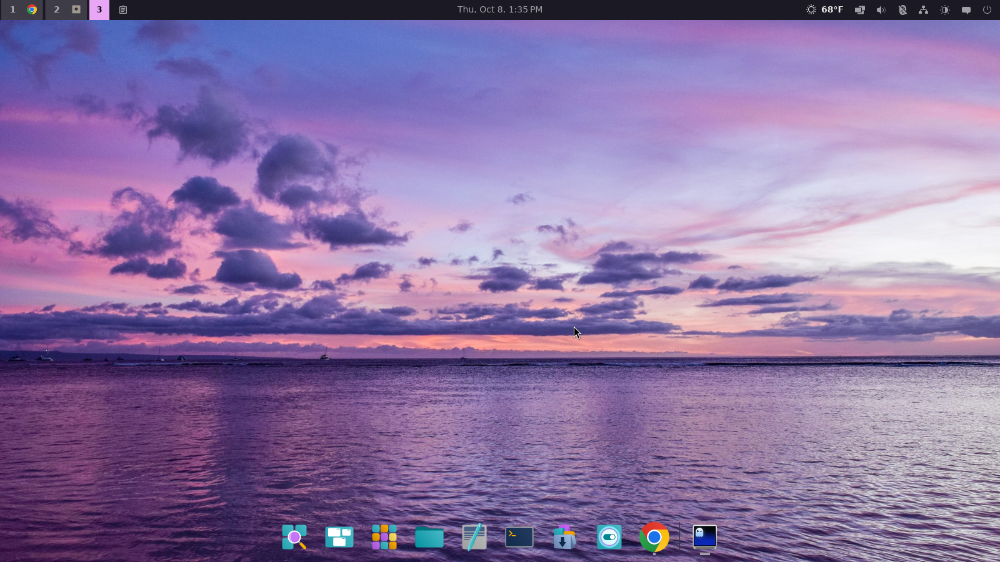
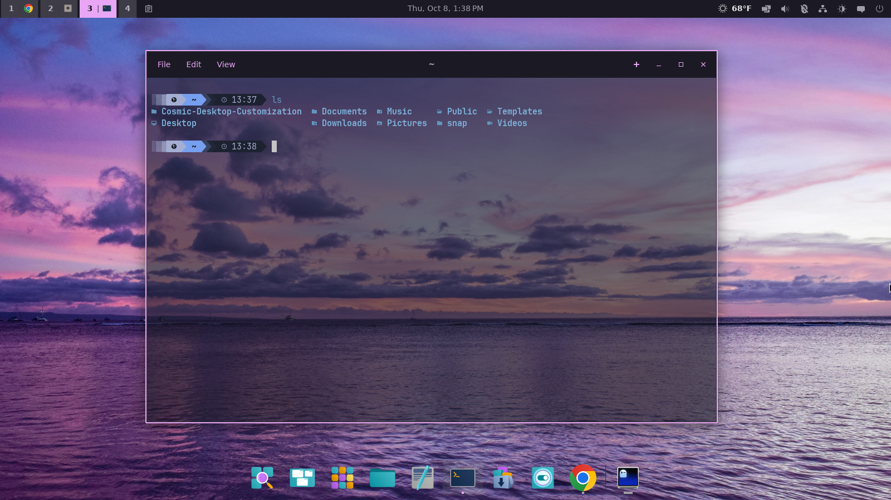
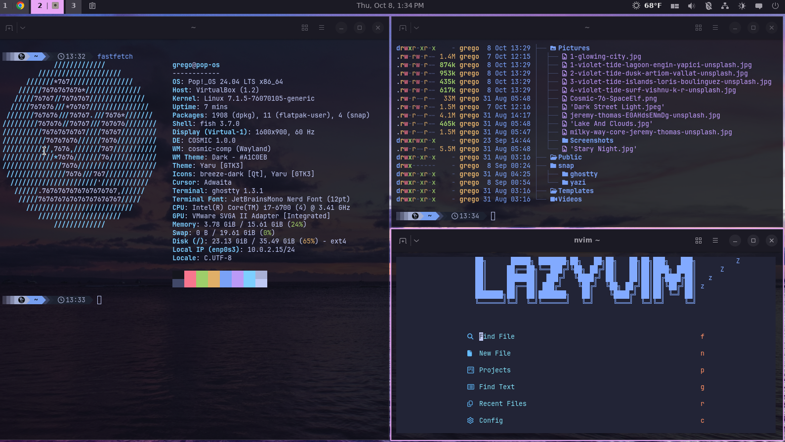

# Violet Tide



- **Wallpaper:** a purple and blue sunset over rippled water, with three
  more sea-and-sky wallpapers copied to `~/Pictures` for switching to
  later (a dark purple dusk, islands at twilight, pink and purple surf).
- **Colors:** dark mode, dark slate-purple background (`#1B1A24`), soft
  grey-white text, pink-lavender accent (`#E8A6F5`). The palette comes
  from the [Violet Tide](https://github.com/ggregoro/violet-tide) Omarchy
  theme.
- **Corners:** square, on windows and controls.
- **Terminal:** COSMIC Terminal at 60% opacity, so the wallpaper shows
  through. COSMIC does not blur what is behind a window, so the
  wallpaper is seen sharp, not frosted as in the Omarchy theme.
- **Layout:** unchanged. This rice sets colors, corners, wallpaper and
  terminal opacity only, so your panel and dock stay as they are.

The color shades were worked out by script from the palette, not
produced by COSMIC. To have COSMIC work them out itself, open Settings >
Desktop > Appearance after applying and pick the accent color once.

Tested on Pop!_OS, Arch Linux and Fedora. The terminal colors import
was tried on Pop!_OS only.

COSMIC Terminal at 60% opacity, with the accent color on the window
border:



Tiled windows (Ghostty and Neovim here, which keep their own colors and
opacity):



The wallpapers are photos from [Unsplash](https://unsplash.com/), used
under the Unsplash License and cropped to 16:9: by Engin Yapici, Artiom
Vallat, Loris Boulinguez and Vishnu K R.

## Extras

**Terminal colors** (optional). The rice does not change COSMIC
Terminal's text colors. To use the Violet Tide ones, open COSMIC
Terminal, choose View > Color schemes > Import, and pick
`rices/violet-tide/extras/violet-tide-terminal.ron`. Then select
"Violet Tide" in the list.

## Install

From the repo folder (see the [main README](../../README.md#install) for the
full steps):

```bash
./switch-rice.sh violet-tide
```

## Uninstall

```bash
./switch-rice.sh --restore
```
